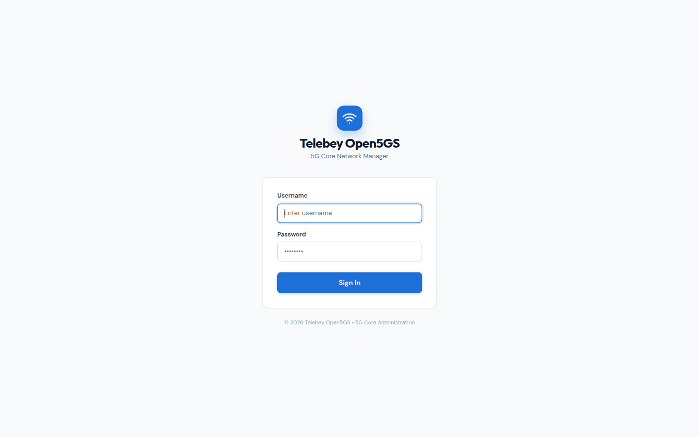
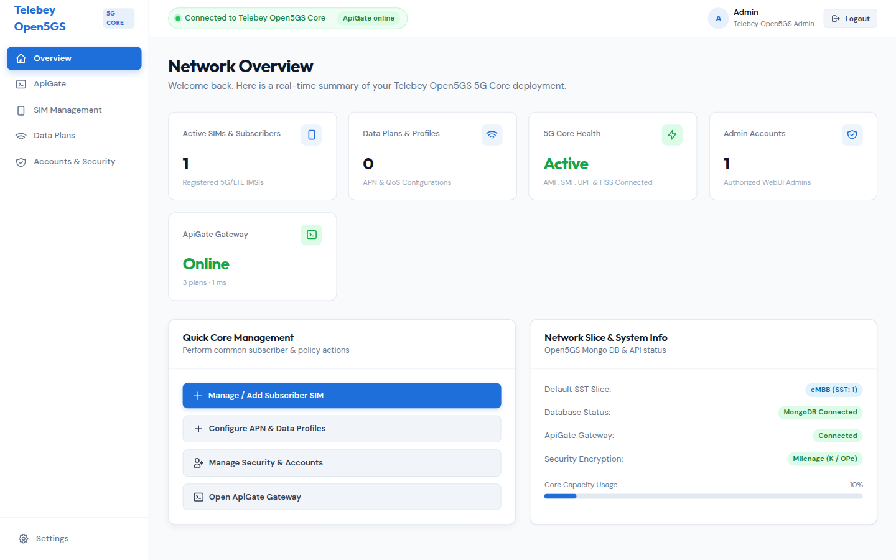
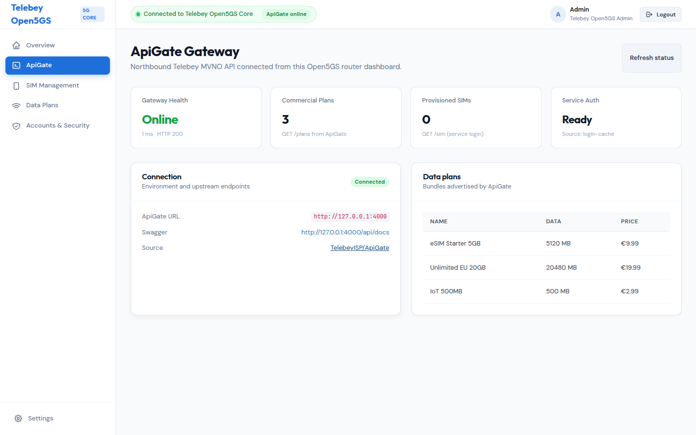
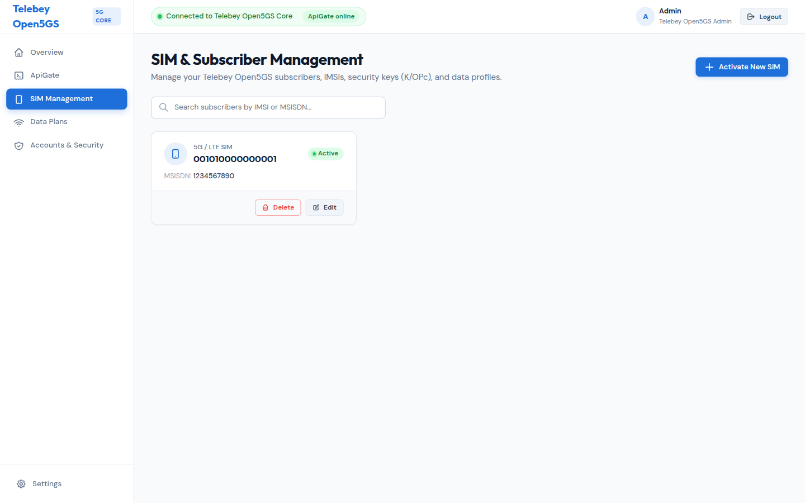
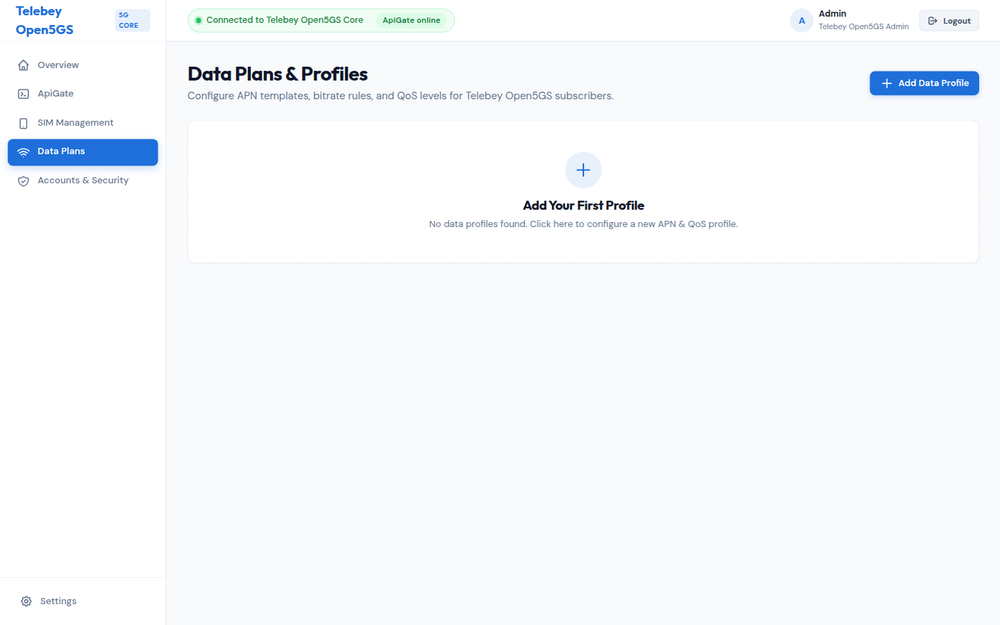
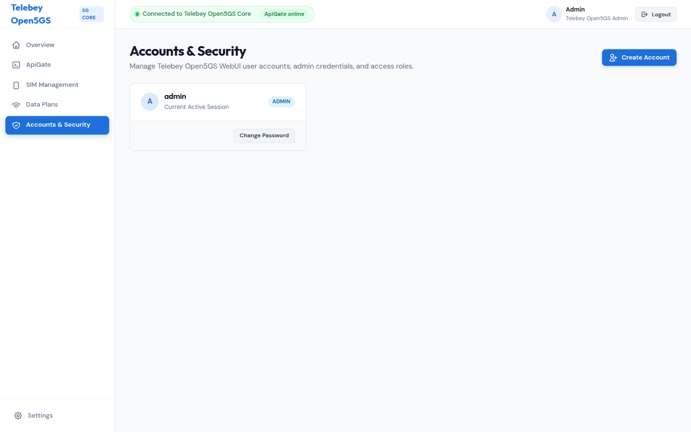

# Telebey Open5GS Router Dashboard

Administration UI for the Telebey Open5GS 4G/5G core. It manages subscribers (IMSI / K / OPc), APN data profiles, and WebUI accounts, and it connects northbound to **[ApiGate](https://github.com/TelebeyISP/ApiGate.git)** — the Telebey MVNO API for commercial plans, SIM lifecycle, and GSMA gateway services.

## Screenshots

Captured from a live run of this dashboard talking to a local ApiGate instance (`GET /health` + `GET /plans`).













## Demo video

<video src="docs/assets/screenshots/router-dashboard-demo.mp4" controls width="800"></video>

If the embedded player is unavailable, download [router-dashboard-demo.mp4](docs/assets/screenshots/router-dashboard-demo.mp4).

## Quick start (WebUI)

Development defaults:

- URL: `http://localhost:9999`
- Username: `admin`
- Password: `1423`

```bash
# MongoDB must be reachable at mongodb://127.0.0.1:27017/open5gs
cd webui
cp .env.example .env   # optional
npm install
npm run dev
```

The dashboard binds to `0.0.0.0:9999` by default and probes ApiGate at `http://127.0.0.1:4000`.

## Connect to ApiGate

Clone and run [TelebeyISP/ApiGate](https://github.com/TelebeyISP/ApiGate.git) next to this repository (or point `APIGATE_URL` at an existing instance).

```bash
git clone https://github.com/TelebeyISP/ApiGate.git ../ApiGate
```

The WebUI does **not** call ApiGate from the browser (CORS is not required). The Node server proxies:

| Dashboard route | Upstream ApiGate |
| --- | --- |
| `GET /api/apigate/health` | `GET /health` |
| `GET /api/apigate/plans` | `GET /plans` |
| `GET /api/apigate/status` | health + plans + optional `/auth/me` and `/sim` |

Environment variables (see `webui/.env.example`):

| Variable | Default | Purpose |
| --- | --- | --- |
| `APIGATE_URL` | `http://127.0.0.1:4000` | ApiGate base URL |
| `APIGATE_TIMEOUT_MS` | `4000` | Upstream timeout |
| `APIGATE_EMAIL` / `APIGATE_PASSWORD` | unset | Optional service login to list SIMs |
| `APIGATE_TOKEN` | unset | Optional bearer token instead of login |
| `OPEN5GS_MONGODB_URI` (ApiGate) | `mongodb://mongo:27017/nextgepc` | Set this to the same Open5GS DB as the dashboard (`mongodb://mongodb:27017/open5gs` in Compose) |

The **ApiGate** sidebar view shows gateway health, latency, advertised data plans, and (when service auth is configured) SIMs owned by the service account. Swagger lives at `$APIGATE_URL/api/docs`.

### Docker Compose (dashboard + ApiGate)

```bash
git clone https://github.com/TelebeyISP/ApiGate.git ../ApiGate
export APIGATE_PATH=../ApiGate
docker compose -f docker-compose.apigate.yml up --build
```

- Dashboard: http://localhost:9999
- ApiGate health: http://localhost:4000/health
- ApiGate Swagger: http://localhost:4000/api/docs

## Tests

```bash
cd webui
npm run test:apigate
```

This checks the ApiGate client against a local fixture server and against an unreachable URL.

## Open5GS core

The rest of this tree is Open5GS. Follow the [Open5GS documentation](https://open5gs.org/open5gs/docs/) to build and run AMF, SMF, UPF, and the other network functions. The WebUI reads and writes the Open5GS MongoDB subscriber database used by HSS/UDR.

## License

Open5GS sources are available under [GNU AGPL v3.0](LICENSE).
